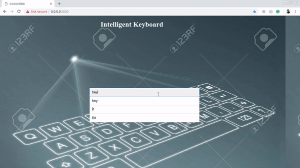

# Hinglish Transliterator
A web application that detects hindi words out of a sentence and automatically converts it to Hindi language. It also
guess in which language to convert for words which are ambiguous and common in both the languages. We use flask as our 
framework to serve the translation to the user. 

## Python Dependencies
Use `pip install` to install these python libraries(Use python 3.5+):
- flask == 1.0.2
- scipy == 1.1.0
- pyenchant == 2.0.0
- langid == 1.1.6

Web page:

Hackindore presentation: https://docs.google.com/presentation/d/1_9jxI1hmJnfad231SLEMRJaa1EDiiK4AkGx6C31rg2k/edit?usp=share_link
